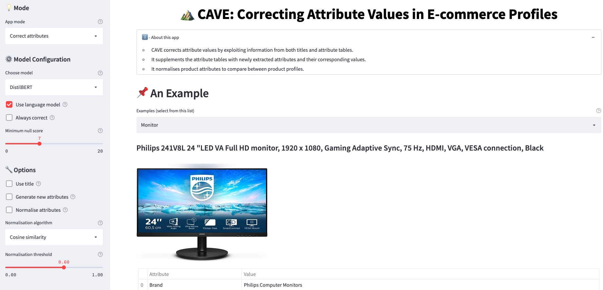
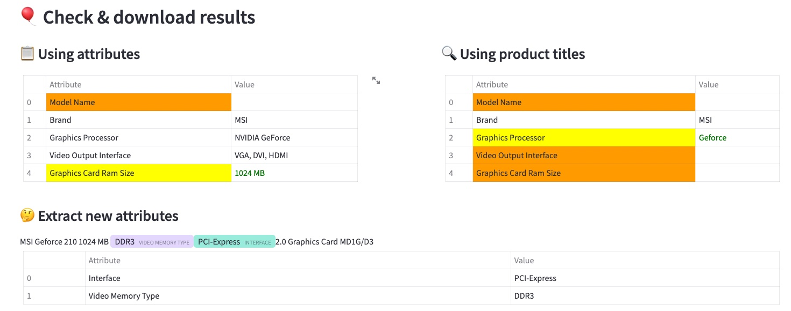
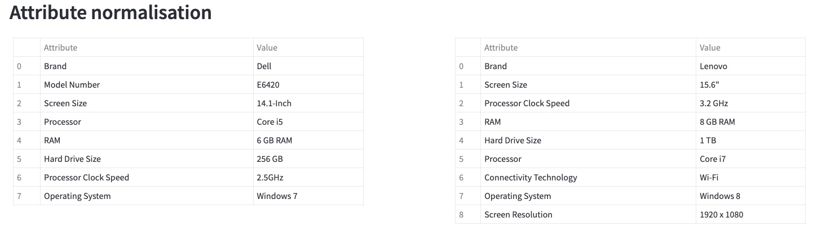

# CAVE: Correcting Attribute Values in E-commerce Profiles
CAVE is a tool for attribute value correction and enrichment in E-commerce. Given a product profile consisting of attributes table and description, CAVE: (1) detects and corrects wrong attribute values (2) enriches the attribute tables with newly extracted attributes and their corresponding values (3) normalises product attributes for product comparison.

CAVE relies on a Question-Answering system for the attribute value correction and extraction tasks. It learns information from both descriptions and attribute tables, using language encoder models to correct attribute values. For this purpose, CAVE is trained on datasets generated from the [Amazon Review Dataset](https://nijianmo.github.io/amazon/index.html).

## Installation
Python 3 is required, and [Streamlit](https://streamlit.io/):
```
pip install streamlit
```
Please refer to `requirements.txt` for all relevent dependencies of the application.

## Usage
1. Clone the repo
2. Run the command below in your terminal
```
streamlit run app.py
```
The above command runs the pythin script `app.py` which is a [streamlit](https://streamlit.io/) web application. Now you can see CAVE web interface:

<center>

</center

The application can be used in two modes:

#### Correct Attributes
In this mode, the application is used to correct existing attribute values and discover new attributes and their corresponding values using information from the product profiles. The extracted information is highlighted as shown below:

<center>

</center

#### Compare Products
In this mode, the application is used to compare between two products. As above, the attributes are first corrected, then the attributes are normalised to their canonical form and displayed side by side for comparison. 

<center>

</center

For more information about using the application, please refer to the [video demonstration](https://bit.ly/3xW1W3E) of our system.